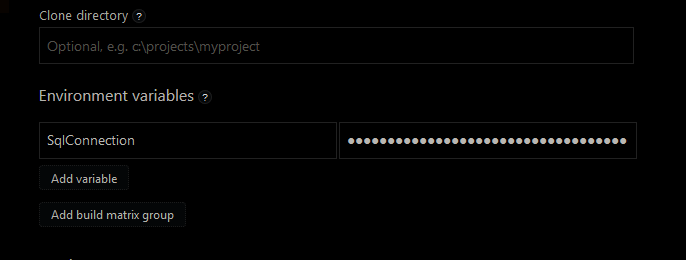

# Reading Env variables from Appveyor

Configure the env variable either by ui:



This is usually done on settings environment per project

If configured under the appveyor.yml configuration, use the scope of environment:

```yml
environment:
  sql_connection:
    secure: <Key goes here>
```

Use the [encryption tool](https://ci.appveyor.com/tools/encrypt) from appveyor

Then, we can use if on the code as needed:

```csharp
    //We do this to pass the connection from Appveyor or locally
    string sqlServerConnEnv = Environment.GetEnvironmentVariable("Sql_Connection");
    if (string.IsNullOrEmpty(sqlServerConnEnv))
    {
        //Not found
        sqlServerConnEnv = "Server=(local);Database=master;Trusted_Connection=true;";
    }
```
