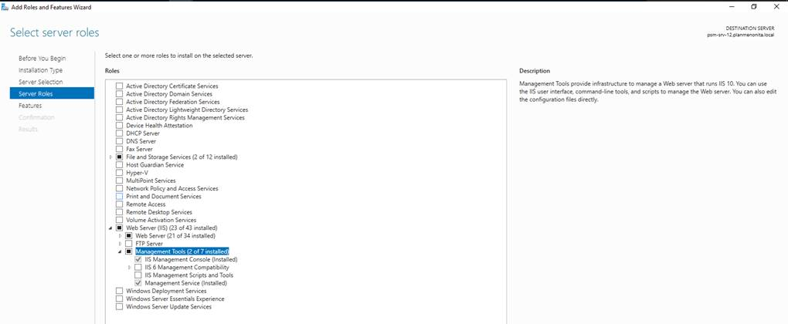
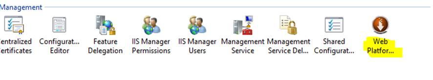
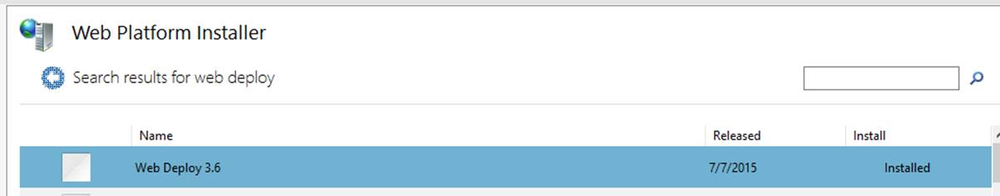
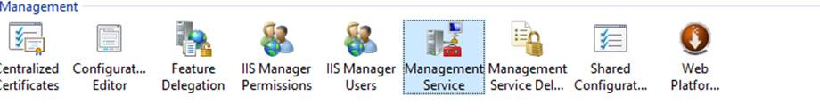
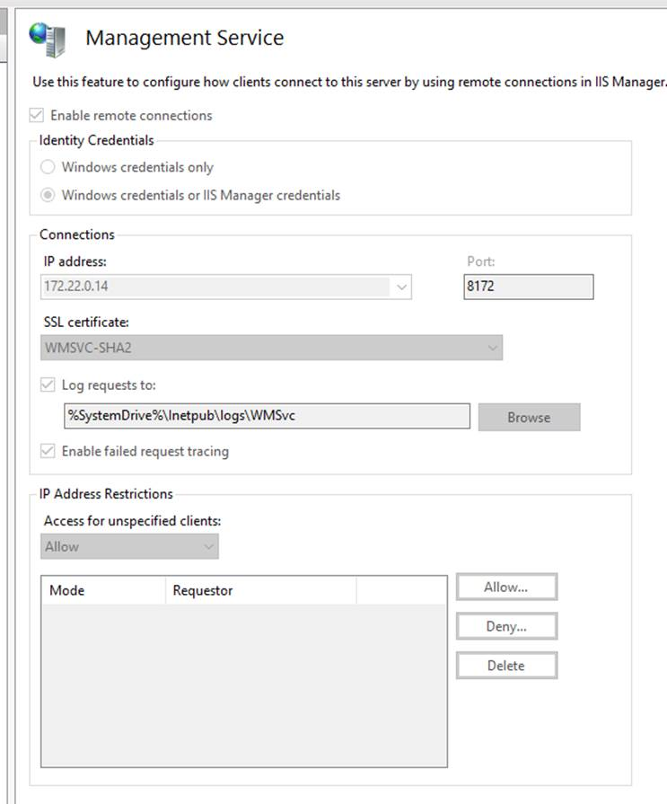

# Installing web deploy on a new IIS

From server manager:

Install the latest web platform installer:

Restart the server after.

Go to service manager in IIS and proceed to configure the allow remote connections, server certificate (if needed):

This completes the server side configuration, now you can configure the client side publish profile as usual, using the option of Web deploy.

